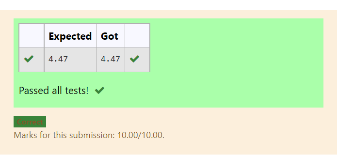

# DISTANCE-BETWEEN-TWO-POINTS

## AIM:
To write a python program to find the distance two 2 points
## ALGORITHM:
### Step 1: 
Program Starts
### Step 2: 
Distance Between two points
### Step 3: 
Substitute the values in the distance formula  
### Step 4: 
Program Completed 
### PROGRAM:
```
import math
x=[10,6]
y=[4,2]
dist=math.sqrt(((x[0]-x[1])**2)+((y[0]-y[1])**2))
print("{:.2f}".format(dist))
```
### OUTPUT:


### RESULT:
We can able to find distance between two points.